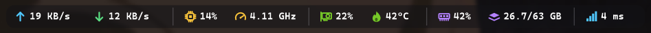
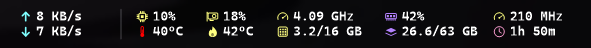

# PC Stats Bar

A lightweight, TrafficMonitor-style stats overlay for the Windows 11 taskbar. It sits just left of the system tray and shows live hardware stats, each with its own icon and colour. Every stat can be switched on or off, reordered, restyled and grouped with dividers.

> **About this project:** I originally made this for my own personal use and decided to share it in case anyone else finds it useful. If you run into a bug or have an idea for a feature, please [open an issue](../../issues). I'll do my best to look into it and implement what I can.



**Latest version: v1.3.0.** [Download it from Releases](../../releases/latest).

## Contents

- [Features](#features)
- [Download and use](#download-and-use)
- [Settings guide](#settings-guide)
- [Tips and shortcuts](#tips-and-shortcuts)
- [CPU temperature](#cpu-temperature)
- [Requirements](#requirements)
- [Known limitations](#known-limitations)
- [Version history](#version-history)
- [Building from source](#building-from-source)
- [Feedback](#feedback)
- [License](#license)

## Features

### Stats

Each one can be turned on or off. There are 28 in total.

| Category | What it shows |
|---|---|
| Network | Upload speed, download speed, total speed (upload + download), ping to any website or IP address |
| CPU | Usage, per-core usage bars, clock speed (GHz), temperature\*, package power\* |
| Memory | RAM usage %, RAM used / total (GB), committed memory % (includes the page file) |
| GPU (NVIDIA, AMD, Intel) | Usage, temperature, clock speed (MHz), fan speed (% or RPM), VRAM used / total (GB), VRAM usage %, power draw. If you have more than one GPU, you can choose which one to show |
| Storage | Disk activity %, read speed, write speed, free space on any drive |
| System | Running processes, uptime |
| Batteries | Laptop battery % (with a + while charging), laptop battery time left, and Bluetooth headphones, mice, keyboards and controllers (each with an icon for its device type) |

\* CPU temperature and power need the app to run as administrator ([see below](#cpu-temperature)).

### Customisation

The same bar can look very different. Here it is in the compact two-line layout:



And with text labels instead of icons and dot-style dividers:


- **Arrange page:** drag rows to set the left-to-right order. Rows follow the mouse, the others slide out of the way, and the page scrolls by itself when you drag near the edge. You can also use the ▲ / ▼ buttons, or select a row and press **Alt+↑ / Alt+↓**.
- **Icon picker:** click any stat's icon to choose one of 37 preset icons, **No icon**, or a short **Text label** such as `CPU`, `GPU` or `RAM`.
- **Per-stat colours:** in the same picker, give any stat or divider its own colour from 15 swatches or any custom colour.
- **Dividers:** add as many as you like to split stats into groups. Choose from four styles (line, dotted line, dot or blank space) and adjust their height.
- **Spacing:** sliders for the gap between stats, the gap between icon and value, edge padding, icon size, and line spacing in the two-line layout.
- **Layout:** one line, or a compact two-line layout that stacks stats in pairs.
- **Text:** any installed font and size. Monospace fonts keep numbers from jumping around.
- **Colours:** set colours for each group of icons, the value text, secondary text, the warning colour and the background. Or let the text match your light or dark taskbar automatically.
- **Background:** a rounded, see-through "pill" behind the stats, with adjustable colour, opacity and corner roundness.
- **Warning limits:** choose when values turn to the warning colour (CPU / RAM / GPU usage, CPU / GPU temperature, low battery, high ping, low disk space).
- **Live preview** at the top of the Settings window shows every change as you make it.

### Quality of life

- Matches a light or dark taskbar automatically
- Hides itself in fullscreen games, videos and presentations
- Left-click opens Task Manager
- Hovering shows details: CPU and GPU model, the ping address, the free-space drive and Bluetooth device names
- Optional run at startup. When it's running as admin, it's set up as an elevated scheduled task, so there's no UAC prompt at login.
- Update interval from 0.5 to 5 seconds
- Shift the bar left if it overlaps other taskbar icons
- **About** tab with the version number and copyright

### Light on resources

- About 15 MB of memory in use. v1.0 used about 100 MB.
- Only redraws when something on the bar has actually changed
- Sensors, performance counters, the Bluetooth battery scan and ping only run while their stats are switched on. The LibreHardwareMonitor sensor library only loads when a stat needs it, and unloads after a minute when nothing does.
- Hands unused memory back to Windows after startup and after closing Settings

## Download and use

1. Download `PCStatsBar.exe` from the [Releases](../../releases/latest) page.
2. Run it. The bar appears on your taskbar next to the tray icons.
3. **Right-click** the bar and choose **Settings…** to customise it, or **Arrange stats…** to go straight to the order and icons.

It's a single portable exe with no installer. Settings are saved in the registry at `HKCU\Software\PCStatsBar`.

**Updating:** right-click the bar, choose **Exit**, replace the exe with the new one and run it again. Your settings carry over.

Windows SmartScreen may warn you because the exe isn't code-signed. Click **More info → Run anyway**.

## Settings guide

| Page | What's on it |
|---|---|
| **Stats** | Switch each stat on or off, grouped by Network, Processor, Memory, Graphics, Storage, System and Batteries. Also: the ping address, which GPU to show, which drive to measure free space on, and whether to show Bluetooth device names. |
| **Arrange** | The order of everything on the bar. Drag rows, click an icon to change it or its colour, **+ Add divider**, remove dividers with ✕, and **Reset order**. Turn off **Show switched-off stats** to list only what's on your taskbar. |
| **Appearance** | Font and size, one or two lines, spacing sliders (with **Reset spacing**), divider style and height, and the background pill's opacity and corner roundness. |
| **Colours** | Match the taskbar theme, text and warning colours, a colour for each icon group, and the background colour. |
| **General** | Update interval, shift left, left-click action, hide in fullscreen, warning limits, run at startup, restart as administrator, and restore default settings. |
| **About** | Version number and copyright. |

## Tips and shortcuts

- **Right-click menu:** Settings…, Arrange stats…, Refresh batteries now, Restart as administrator, Exit
- **Arrange page keys:** ↑ / ↓ select a row, **Alt+↑ / Alt+↓** (or Ctrl) move it, **Space** switches it on or off, **Delete** removes a divider
- **Sliders:** click one first, then use the mouse wheel or ← / → keys for fine adjustments
- **Text labels instead of icons:** open the icon picker and choose **Text** for a compact, icon-free look
- **Grouping:** add dividers, then pick a divider style on the Appearance page. **Blank space** gives gaps without lines.
- **Command line:** `PCStatsBar.exe --settings Arrange` opens Settings on a specific page (Stats, Arrange, Appearance, Colours, General or About)

## CPU temperature

Windows doesn't provide CPU temperatures to normal apps, so PC Stats Bar reads them through [LibreHardwareMonitor](https://github.com/LibreHardwareMonitor/LibreHardwareMonitor)'s library, which is built into the exe. This requires:

- **Administrator rights:** right-click the bar and choose **Restart as administrator**. To have it start elevated automatically, turn on **Run at startup** while it's running as admin.
- **The PawnIO driver:** it's installed along with the LibreHardwareMonitor app, or you can get it from [pawnio.eu](https://pawnio.eu).

## Requirements

- Windows 10 / 11 (64-bit)
- .NET Framework 4.7.2 or later (already included in Windows 10 and 11)
- An up-to-date graphics driver for GPU stats. NVIDIA cards are read through the driver's `nvml.dll`, and AMD / Intel cards through LibreHardwareMonitor. Neither needs admin rights.

### Choosing a GPU

On PCs with more than one GPU (for example, a desktop card plus the processor's built-in graphics), go to **Settings → Stats → Graphics card**. **Auto** picks the NVIDIA card if there is one, and otherwise the card with the most video memory.

## Known limitations

- Some stats aren't available on every GPU. Integrated graphics often don't report temperature, power, clock or fan speed.
- GPU fan speed shows 0% when the card's fans have stopped at idle, which many cards do.
- Batteries of devices on proprietary USB dongles (Razer HyperSpeed, Logitech Lightspeed, SteelSeries, etc.) are only visible to their vendor apps, so they aren't shown. The same devices connected over Bluetooth do work.
- Ping uses ICMP, which some networks and servers block. If it always shows the warning colour, try another address such as `8.8.8.8`.

## Version history

### v1.3.0: license change
- PC Stats Bar is now free software under the **GNU General Public License v3.0** (or later). Versions up to and including v1.2.1 were released under the MIT License.
- The About tab shows the new license.

### v1.2.1
- The license and the exe's company details name Akila Sella Hennedige as the copyright holder.

### v1.2.0: About tab
- New **About** tab in Settings with the app icon, version number and copyright.
- The version shown at the bottom of the Settings sidebar includes the patch number (e.g. v1.2.0).

### v1.1.0: customisation and efficiency update

**Icon and colour picker**
- Click any stat's icon on the Arrange page to open a picker with 37 preset icons
- Choose **No icon** or a short **Text** label instead of an icon
- Give any single stat, or any divider, its own colour from 15 swatches or a custom colour

**Dividers**
- Add as many dividers as you want with **+ Add divider**, and remove them with ✕ or the Delete key. v1.0 had three fixed dividers.
- Four styles (line, dotted line, dot, blank space), plus an adjustable height
- Dividers keep a little space either side even at the tightest spacing

**Spacing and shape**
- Spacing sliders: between stats, between icon and value, edge padding, icon size, and two-line line spacing
- Corner roundness slider for the background pill
- **Reset spacing** button

**A better Arrange page**
- Rows follow the mouse when dragged, and the other rows slide out of the way
- Auto-scrolls when you drag near the top or bottom
- Keyboard support: ↑/↓ to select, Alt+↑/↓ to move, Space to switch on/off, Delete to remove a divider
- **Show switched-off stats** switch, and a **Reset order** button

**11 new stats**
- Network: total speed, and ping to an address you choose
- Memory: committed memory %
- GPU: clock speed, fan speed, VRAM usage %
- Storage: disk read speed, disk write speed, free space on any drive
- System: running processes, uptime
- Battery: laptop battery time left

**Warning limits**
- New **General → Warnings** section for CPU / RAM / GPU usage, CPU / GPU temperature, low battery, high ping and low disk space

**Lower memory use**
- Measured side by side with the same settings: memory in use went from about 100 MB to about 15 MB, the app's own memory from 31 MB to 20 MB, and CPU time was roughly halved
- The bar is only redrawn when something has changed, into one reusable image instead of a new one every second
- LibreHardwareMonitor only loads when needed and unloads when idle
- Performance counters, the battery scan and ping only run while their stats are shown
- The network adapter list, installed-font list and fonts are cached
- Unused memory is handed back to Windows after startup and after closing Settings
- Settings are saved once you stop adjusting, instead of on every slider movement

**Other**
- **Arrange stats…** shortcut in the right-click menu
- 5-second update interval option
- Version shown in the Settings window
- Settings from v1.0 carry over. Dividers that were switched on are kept, and the rest are removed.

### v1.0.0: first release
- Taskbar overlay with network, CPU, RAM, GPU, disk and battery stats
- Arrange page with drag-and-drop and ▲ / ▼ buttons, and three dividers
- One or two lines, font picker, colour picker, see-through background
- Light/dark taskbar matching, warning colours, fullscreen hiding, Task Manager on click, run at startup

## Building from source

No Visual Studio or SDK needed. It compiles with the .NET Framework compiler that's built into Windows.

1. Put the [LibreHardwareMonitorLib 0.9.6](https://www.nuget.org/packages/LibreHardwareMonitorLib/0.9.6) NuGet package's .NET Framework DLLs (`runtimes/win-x64/lib/net472`), along with its dependencies' DLLs, into a `lib\` folder next to the source. The dependencies are DiskInfoToolkit, BlackSharp.Core, HidSharp, RAMSPDToolkit-NDD, System.Memory, System.Buffers, System.Numerics.Vectors, System.Runtime.CompilerServices.Unsafe, System.CodeDom, System.Threading.AccessControl, System.Security.AccessControl and System.Security.Principal.Windows.
2. Run:

   ```bat
   build.bat
   ```

   This produces a single `PCStatsBar.exe`, with every DLL in `lib\` and the app icon embedded inside it.

## Feedback

Found a bug or want a feature? [Open an issue](../../issues) and include your Windows version, CPU/GPU, and a screenshot if possible. Pull requests are welcome too.

## License

Copyright © 2026 Akila Sella Hennedige.

Released under the [GNU General Public License v3.0](LICENSE) (GPL-3.0-or-later). You're free to use, study, modify and share it, including commercially, as long as anything you distribute that's based on it is also released under the GPL with its source code available.

Versions up to and including v1.2.1 were released under the MIT License.

Third-party components bundled in the release exe keep their own licenses. [LibreHardwareMonitorLib](https://github.com/LibreHardwareMonitor/LibreHardwareMonitor) is licensed under MPL-2.0, and HidSharp under Apache-2.0.
