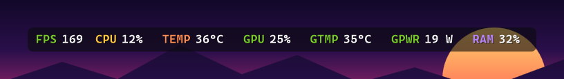
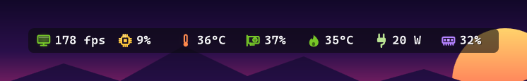
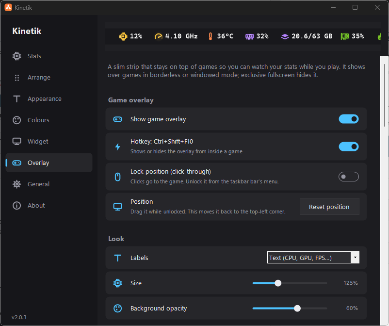

# Kinetik v3.0.0

Kinetik 3 is a big update for gaming: frame-generation-aware FPS, 1% lows, frame times and latency on the game overlay, which now shows itself, follows your game to its monitor and closes with it. There are also notifications, hover graphs on the bar, 14 new stats, profiles, and updates that install themselves.

**For gaming**
- **New: Base FPS.** The frame rate the game renders itself, before DLSS or FSR frame generation adds frames. FPS keeps showing what reaches the screen. Works in games with NVIDIA Reflex, which every DLSS frame generation game has.
- **New: 1% and 0.1% lows.** The frame rate that 99% (or 99.9%) of frames beat over the last 10 seconds. They show stutter that an average hides.
- **New: frame time graph.** The time per frame, with a little graph of the last 3 seconds. Spikes are stutters.
- **New: render latency.** Time from a game starting a frame to presenting it, in games with NVIDIA Reflex.
- **New: show the overlay automatically.** **Settings → Overlay → Show automatically in games** brings the overlay up while a fullscreen or borderless game is in front, and hides it when you leave. Ctrl+Shift+F10 hides it for the rest of that game.
- **New: the overlay follows your game.** On a PC with several monitors, the overlay moves to the same spot on whichever monitor the game is on, and back afterwards (**Move to the game's monitor**).
- **New: the overlay closes with the game.** When the game it was showing for exits, the overlay turns off, even if you turned it on yourself (**Close with the game**).
- **New: session summaries.** When a game closes, a notification shows how long you played, the average FPS, the 1% low and the peak GPU temperature. Each session of a minute or more is also saved to `Documents\Kinetik\Sessions.csv`, including when Kinetik closes before the game.
- **New: benchmark recording.** **Ctrl+Shift+F11** (or **Record benchmark** in the right-click menu) records every stat, each update, to a CSV file in `Documents\Kinetik\Benchmarks`. Press it again to stop.

**Notifications** (Settings → General → Notifications)
- When the CPU or GPU stays above its warning temperature for 30 seconds.
- When a Bluetooth device's battery, or the laptop's, drops below its warning level.
- When the free-space drive runs low (at most every 6 hours).
- Optional: when ping stays high or times out.

**On the bar**
- **New: hover graphs.** Hover over a stat for its last minute as a graph, its minimum, average and maximum, and the processes using the most CPU, memory, GPU, disk or network. Turn it off in **Settings → Appearance → Hover graphs**.
- **New: show on all taskbars.** **Settings → General → Show on all taskbars** puts a copy of the bar on every monitor's taskbar.

**New stats**
- GPU hot spot and GPU memory temperature (not every card reports these).
- Drive temperature (the hottest drive) and RAM temperature (if your memory reports it). Both need administrator rights.
- Top network app (needs administrator rights), VPN status, public IP address (asks api.ipify.org every 5 minutes while it's shown), time and date.

**Settings**
- **New: profiles.** Save your setup under a name (for example Gaming and Work) in **Settings → General → Profiles and backup**, and switch between them there or from the right-click menu.
- **New: back up and restore** every setting to a `.kinetik` file.
- **New: install updates from Kinetik.** **Settings → About → Check for updates** can now download and install a new version. It checks the download against the SHA-256 in the release notes before changing anything, keeps the old files until the next start, and restarts Kinetik. **Include test versions** also offers test builds.

**Notes**
- FPS, the lows, frame times, latency, game detection and per-app network all need Kinetik to run as administrator, like before.
- While Base FPS or render latency is shown, games with NVIDIA Reflex measure their own latency a few times a second, as they do with NVIDIA FrameView.
- An elevated startup copy in `C:\Program Files\Kinetik` is now only ever replaced by a newer version, so running an older copy as administrator no longer downgrades it.

**Updating from v2.x:** right-click the bar → **Exit**, then extract the zip into the folder where your old `Kinetik.exe` was, replacing it and its `lib` folder. From v3.0.0 on, **Settings → About → Check for updates** installs new versions for you. If you use **Run at startup**, run the new Kinetik once as administrator so the startup copy is updated too.

**SHA-256 of `Kinetik.exe`:** `007D3B8BFAF418DA771A539FFA725C1C442255B9282E586A67CEA7E79B061EAD`. To check your copy, run `Get-FileHash Kinetik.exe` in PowerShell.

---

# Kinetik v2.0.4

- **The download is now a zip.** `Kinetik.zip` contains `Kinetik.exe` and a `lib` folder. Extract it anywhere and keep the two together. The `lib` folder holds the LibreHardwareMonitor library that reads CPU temperature and AMD / Intel GPUs.
  - Until now that library was packed inside the exe and unpacked into memory when Kinetik started. Antivirus software treats programs that do this with suspicion, which is the likely reason some people saw Windows Defender flag Kinetik. The exe no longer does it, and is now about 290 KB instead of 3.3 MB.
- **Security: every DLL is checked before it loads.** Kinetik compares each file in `lib` with the exact version it was built with (by SHA-256) and refuses any that don't match. A DLL swapped into the folder can't run inside Kinetik, even when it's running as administrator.
- **Elevated startup copies the `lib` folder too.** With **Run at startup** on as administrator, `C:\Program Files\Kinetik` now gets the `lib` folder alongside the exe.

**Updating from v2.0.3 or earlier:** right-click the bar → **Exit**, then extract the zip into the folder where your old `Kinetik.exe` was, replacing it. If you use **Run at startup**, run the new Kinetik once as administrator (right-click → **Restart as administrator**) so the startup copy is updated too.

**SHA-256 of `Kinetik.exe`:** `399B8797D5B98BE607CDEE1779BA50D7ED10ABAD2BBC00C5B7A3CC3C6BCF77E1`. To check your copy, run `Get-FileHash Kinetik.exe` in PowerShell.

---

# Kinetik v2.0.3

- **New: game overlay.** A slim, always-on-top strip of stats you can keep on screen while you play.
  - Turn it on from the bar's right-click menu (**Game overlay**), in **Settings → Overlay**, or with **Ctrl+Shift+F10**. The hotkey also works from inside a game.
  - It has its own list of stats and order, with dividers, separate from the bar and the widget. Show them with text labels (`CPU`, `GPU`, `FPS`…) or icons, and adjust the size and background opacity.
  - Drag it anywhere. It snaps to the screen's edges and top centre. **Lock position** makes it click-through, so clicks go to the game.
  - It stays visible over fullscreen apps, unlike the bar and widget. It shows over games in **borderless or windowed** mode. Exclusive fullscreen owns the whole display, so no overlay can draw there.

- **New: FPS counter.** Shows the frame rate of the app in front, on the overlay (on by default), the bar or the widget. It counts the frames Windows' graphics system reports for DirectX 9–12 games, and for OpenGL and Vulkan games. Like CPU temperature, it needs Kinetik to run as administrator.
- **Fix: CPU power and temperature on laptops.** Some laptops showed neither, because they were only read through LibreHardwareMonitor, which needs the PawnIO driver.
  - CPU power now falls back to Windows' own power meter, which needs no driver or admin rights.
  - CPU temperature falls back to the ACPI thermal zone on PCs that report a believable one (most laptops). The tooltip marks this reading as approximate.
- **Clearer messages for CPU temperature.** Settings → General says when the **PawnIO driver** is missing and has a **Get PawnIO** button. It no longer claims temperatures are available just because Kinetik is running as administrator. The bar's tooltip says what's missing.

---

# Kinetik v2.0.2

- **Fix:** in **Settings → Widget**, the **Background colour** row's colour square and **Default** button were pushed up and cut off. Controls on the right of settings rows now stay centred once they've settled to their final size.

---

# Kinetik v2.0.1

- **Security: elevated startup now runs a protected copy.** With **Run at startup** on as administrator, Kinetik starts elevated at sign-in without a UAC prompt. Until now that ran the exe from wherever you'd put it, usually a folder any program on your account can write to. Malware already running as you could have replaced it, or dropped a DLL next to it, to get admin rights at your next sign-in.
  - Elevated startup now installs a copy to `C:\Program Files\Kinetik`, which only administrators can change, and runs that. Without admin rights, startup falls back to a normal, unelevated start.
  - Existing elevated startup entries are moved over automatically the next time Kinetik runs as administrator. **Run Kinetik once as administrator after updating** (right-click → **Restart as administrator**).
  - When you run a newer Kinetik as administrator, the installed copy is updated to match. Turning Run at startup off removes it.
- **Security: DLLs and helper programs only load from Windows' System32 folder.** Kinetik no longer looks for `nvml.dll` (NVIDIA stats), Windows' own DLLs or Task Manager by name alone, which would have searched its own folder first. `nvml.dll` is loaded from System32, or from NVIDIA's admin-only install folder on older drivers.
- **Security: startup tasks are registered directly through the Task Scheduler API.** No more `schtasks.exe` or temporary task file that another program could swap before Windows read it.
- **Hardening:** no error log is written while running as administrator, and the desktop shortcut's icon file is never written through a redirected folder or an existing file.
- The exe's product version now shows the right number in its file properties (v2.0.0 still said 1.4.1).
- **New: check for updates.** **Settings → About → Check for updates** asks GitHub for the latest version. If there's a newer one, the button opens its release page in your browser. Nothing is downloaded or run automatically.
- **Hardening:** settings read from the registry are kept within safe limits, so a bad or tampered value can't crash Kinetik or make it draw an enormous window.
- **Fix:** long descriptions in Settings no longer run underneath the button or switch beside them.

---

# Kinetik v2.0.0

- **New name and logo: PC Stats Bar is now Kinetik.** The new logo is a three-bladed fan. The exe is now `Kinetik.exe`.
  - Your settings are copied over automatically the first time Kinetik runs
  - If you had **Run at startup** on, start Kinetik once as administrator (right-click → **Restart as administrator**) so it can swap the old startup entry for the new one
- **New: spinning fan tray icon.** The tray icon is a three-bladed fan that spins faster the busier your CPU is. Pick its background in **Settings → General → Icon background** (Kinetik orange by default, plus 10 more), or stop it spinning with **Spinning icon**.
- **New: show on the taskbar.** Turn on **Settings → General → Show on the taskbar** to get a taskbar button like other running apps, with the same spinning fan. Click it for Settings; "Close window" exits Kinetik.
- **New: desktop shortcut.** Turn on **Settings → General → Desktop shortcut** to add a Kinetik shortcut to your desktop. Opening it while Kinetik is already running brings up Settings.
- **New stat: Wi-Fi signal strength**, on the bar and the widget. Shows the signal quality of the network you're connected to (the widget also shows its name), turns the warning colour at 25% or below, and on the animated Wi-Fi icon only as many waves light up as your signal reaches. It's on in the widget by default; turn it on for the bar in **Settings → Stats → Network**.
- **New: settings window background colours.** Pick from Charcoal (default), Pure black, Slate, Midnight blue, Deep violet, Forest, Wine or Espresso in **Settings → General → Background colour**.
- **New: animated icons** on the taskbar bar and the desktop widget. Every icon acts out what it shows, and moves faster or harder the busier its stat is:
  - Fans spin with fan speed (with motion blur when fast), and the graphics-card icon's fan spins with GPU load
  - Upload/download arrows stream in their direction; drive arrows flow in and out while the activity LED flickers
  - Thermometers fill up and turn redder as things heat up, with heat shimmer when hot; flames flicker and throw sparks
  - Power bolts crackle with little electric arcs; the CPU chip's pins light up in a chase and its core glows under load
  - The gauge needle swings to the current load, RAM chips blink like LEDs, VRAM cells twinkle, core cells bounce like an equaliser
  - Wi-Fi waves radiate, signal bars sweep, the globe turns, the clock ticks, the hourglass drains and flips, the pulse traces like a heart monitor, and ping beats like a heart
  - A soft glow behind each icon brightens with activity, and turns orange-red past a warning limit
- **Animation settings:** turn animations on or off separately for the bar (**Settings → Appearance → Animation**) and the widget (**Settings → Widget**), and pick a frame rate: 15, 30 or 60 fps.
- **New: tray icon backgrounds.** Choose the tray icon's colour in **Settings → General → Tray icon background**: Violet to cyan (default), Ocean blue, Emerald, Sunset, Crimson, Hot pink, Graphite, Midnight, Light, or no background.
- **Fix: fullscreen hiding is now per monitor.** With **Hide in fullscreen apps** on, only the bar or widget on the same screen as the fullscreen game or video hides. The one on your other monitor stays visible.

---

# PC Stats Bar v1.4.1

- **New: tray icon.** PC Stats Bar now has an icon in the system tray, next to the clock.
  - Click it to open Settings
  - Right-click it for the same menu as the bar, so the menu is still reachable when the bar is hidden (for example by a fullscreen app)
  - Hover over it for a quick CPU / RAM / GPU summary
  - Turn it off in **Settings → General → Show tray icon**
  - Windows 11 puts new tray icons under the **^** arrow at first. Drag it onto the taskbar to keep it visible.

---

# PC Stats Bar v1.4.0

- **New: desktop widget.** A floating panel for your desktop, like LibreHardwareMonitor's gadget but more polished. Turn it on from the bar's right-click menu (**Desktop widget**) or **Settings → Widget**.
  - Stats are grouped under headings (Processor, Graphics, Memory, Network, Storage, System, Battery) with your CPU and GPU model names
  - Each stat has a coloured usage bar and/or a scrolling history graph, and CPU cores get a per-thread bar chart
  - Four styles: Bars, Graphs, Bars and graphs, Minimal
  - Dark, light or match-Windows theme, with custom background colour, opacity, size, width, corner roundness, shadow and an optional title
  - Place it on the desktop behind your windows, as a normal window, or always on top
  - Drag it anywhere. It snaps to screen edges and remembers its position, and can be locked or made click-through.
  - Has its own list of stats and order (drag to rearrange, with dividers), while sharing icons, colours and warning limits with the bar
  - Graph history of 30 seconds to 5 minutes
- Stats are measured only when the bar or the widget shows them, so the widget costs nothing while it's off.

---

# PC Stats Bar v1.3.1

- **Run at startup no longer uses PowerShell.** The startup task is now created with Windows' built-in `schtasks` tool, so antivirus programs (such as Bitdefender) no longer flag it as suspicious. It works the same as before: it starts elevated at sign-in with no UAC prompt, runs on battery, and has no time limit. If you already had Run at startup on, you don't need to change anything.

---

# PC Stats Bar v1.3.0

- **License change:** PC Stats Bar is now free software under the [GNU General Public License v3.0](LICENSE). You can still use, modify and share it freely, but modified versions you distribute must also be GPL with source available. Earlier releases (v1.2.1 and before) remain under the MIT License.
- The About tab shows the new license.

---

# PC Stats Bar v1.2.1

- The license and the exe's company details now name Akila Sella Hennedige as the copyright holder

---

# PC Stats Bar v1.2.0

## What's new
- New **About** tab in Settings showing the version number and copyright (© Akila Sella Hennedige)
- The version shown at the bottom of the Settings sidebar now includes the patch number (e.g. v1.2.0)

Download **`PCStatsBar.exe`** below and replace your old copy (right-click the bar → **Exit** first). Your settings carry over unchanged.

---

# PC Stats Bar v1.1.0

A customisation and efficiency update: pick your own icons and colours per stat, add as many dividers as you like, fine-tune spacing, reorder with a much smoother Arrange page, and choose from 11 new stats. It also uses a fraction of the memory it did before.

Your existing settings carry over. Any of v1.0's three dividers that you had switched on are kept, and the rest are removed.

## Download

Download **`PCStatsBar.exe`** below and replace your old copy. If PC Stats Bar is running, right-click it and choose **Exit** first. It's still a single portable file with no installer.

## What's new

### Icon and colour picker
- Click any stat's icon on the **Arrange** page to open a picker with 37 preset icons
- Choose **No icon** or a short **Text** label (for example `CPU` or `GPU`) instead of an icon
- Give any single stat, or any divider, its own colour from 15 swatches or a custom colour

### Dividers
- Add as many dividers as you want with **+ Add divider**, and remove them with ✕ (or the Delete key)
- Four styles: line, dotted line, dot or blank space, plus an adjustable height

### Spacing and shape
- New **Spacing** sliders: between stats, between icon and value, edge padding, icon size, and line spacing for the two-line layout
- **Corner roundness** slider for the background pill
- **Reset spacing** puts everything back to the defaults

### A better Arrange page
- Rows follow your mouse when you drag them, and the other rows slide out of the way
- The page scrolls automatically when you drag near the top or bottom
- Keyboard support: ↑/↓ to select, **Alt+↑/↓** to move, Space to switch on/off
- **Show switched-off stats** can be turned off to list only what's on your taskbar
- **Reset order** button

### New stats
- **Network:** total speed (upload + download), ping to any address you choose
- **Memory:** committed memory %
- **GPU:** clock speed, fan speed, VRAM usage %
- **Storage:** disk read speed, disk write speed, free space on any drive
- **System:** running processes, uptime
- **Battery:** time left on a laptop battery

### Warning limits
- New **General → Warnings** section to set when values turn to the warning colour: CPU/RAM/GPU usage, CPU/GPU temperature, low battery, high ping and low disk space

### Lower memory use
- Measured side by side with the same settings: memory in use (working set) went from about 100 MB to about 15 MB, the app's own heap from 31 MB to 20 MB, and CPU time was roughly halved
- The bar is only redrawn when something on it has changed, and it's drawn into one reusable buffer instead of a new image every second
- The LibreHardwareMonitor sensor library is only loaded when a stat needs it, and unloads after a minute when nothing does
- Performance counters, the battery scan and ping only run while their stats are shown
- The network adapter list, installed-font list and fonts are cached instead of rebuilt every update
- Memory is handed back to Windows after startup and after closing Settings
- Settings are saved once you stop adjusting, instead of on every slider movement

### Other improvements
- Right-click menu has a new **Arrange stats…** shortcut
- 5-second update interval option
- The version number is shown in the Settings window

## Requirements
- Windows 10 / 11 (64-bit)
- .NET Framework 4.7.2+ (already included in Windows 10 and 11)
- For CPU temperature: admin rights and the PawnIO driver (installed with LibreHardwareMonitor, or from [pawnio.eu](https://pawnio.eu))

## Known limitations
- Batteries of devices on proprietary USB dongles (Razer HyperSpeed, Logitech Lightspeed, SteelSeries, etc.) are only visible to their vendor apps, so they aren't shown. The same devices connected over Bluetooth work.
- Integrated graphics often don't report temperature, power, clock or fan speed.
- Windows SmartScreen may warn you because the exe isn't code-signed. Click **More info → Run anyway**.

## Credits
CPU and AMD/Intel GPU sensors are powered by [LibreHardwareMonitor](https://github.com/LibreHardwareMonitor/LibreHardwareMonitor) (MPL-2.0), which is bundled inside the exe.
